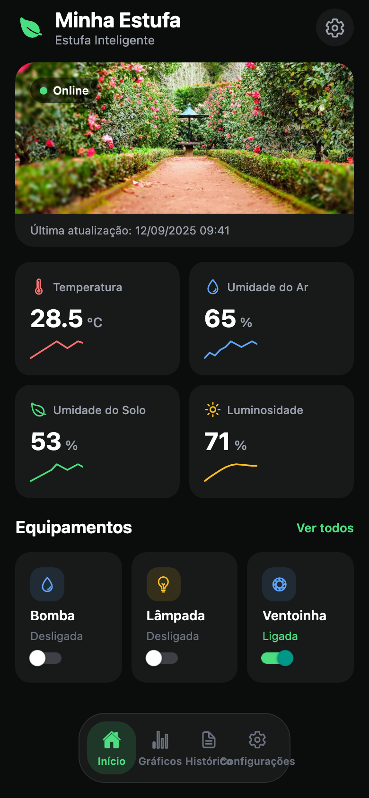
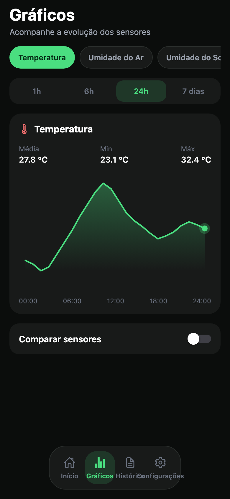
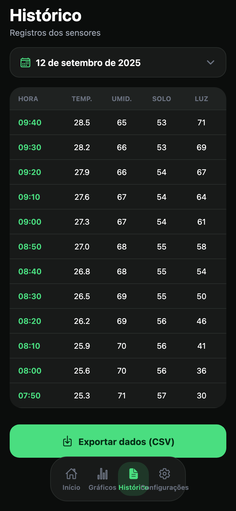
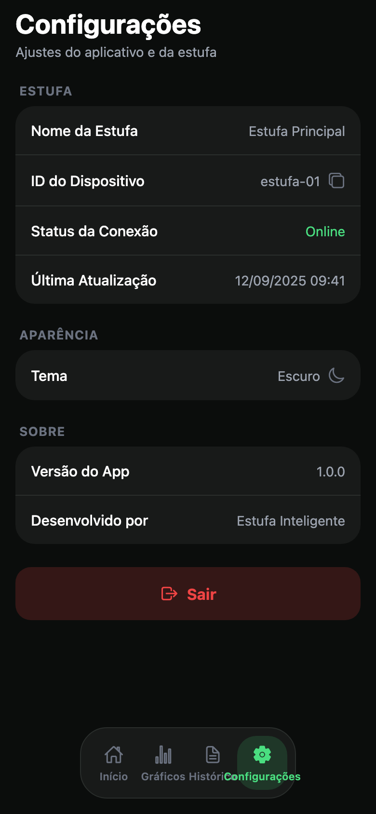
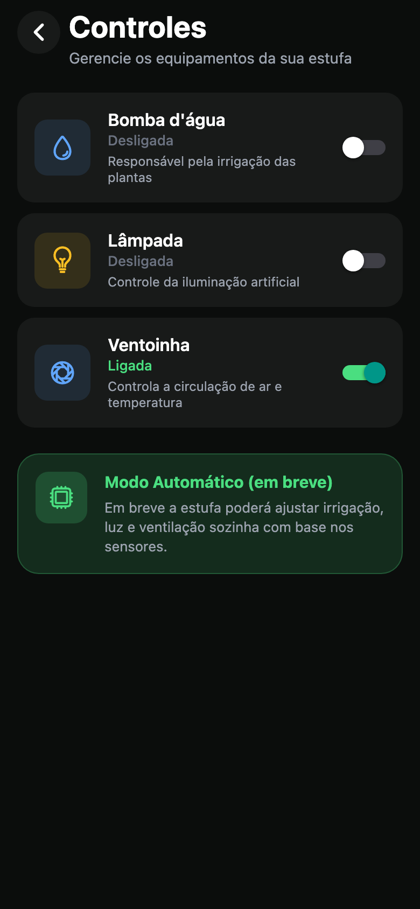
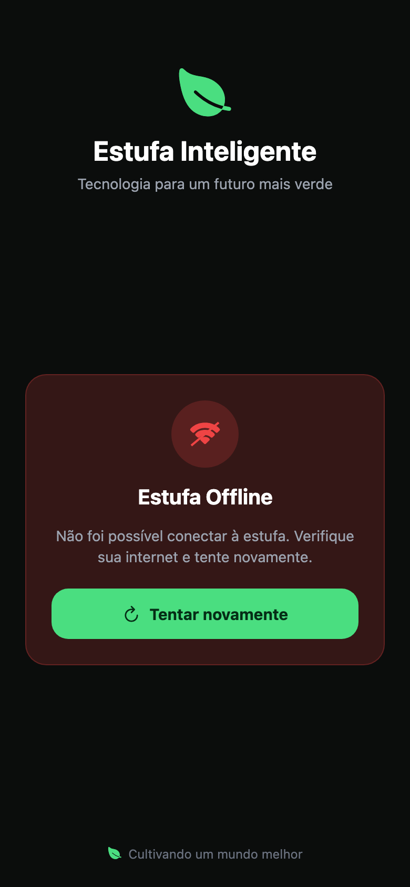

# Estufa Inteligente

App mobile para monitorar e controlar uma estufa conectada. Acompanhe sensores em tempo real, ligue ou desligue equipamentos e consulte o histórico ambiental — tudo em um tema escuro com acentos verdes.

Feito com [Expo](https://expo.dev) (SDK 57) e [Expo Router](https://docs.expo.dev/router/introduction/).

## O que o app faz

A **Estufa Inteligente** concentra o painel da estufa em um só lugar:

- Ver temperatura, umidade do ar, umidade do solo e luminosidade
- Controlar bomba d'água, lâmpada e ventoinha
- Analisar a evolução dos sensores em gráficos
- Consultar e exportar registros históricos
- Conferir status de conexão e dados do dispositivo

A conexão principal é **Bluetooth Classic Serial** (`EstufaESP32`).  
Enquanto o app está conectado e recebe STATUS, envia **a cada 1 hora** temperatura, umidade do ar, umidade do solo e luminosidade para o Supabase (`sensor_history` + `greenhouse_status`), para gráficos/histórico.

```
Sensores/Relés ↔ ESP32 ↔ Bluetooth ↔ App → Supabase (histórico ~1h)
```

### Supabase (histórico horário)

1. Crie o projeto e rode [`supabase/schema.sql`](supabase/schema.sql) no SQL Editor.
2. Copie [`.env.example`](.env.example) para `.env` e preencha:
   - `EXPO_PUBLIC_SUPABASE_URL`
   - `EXPO_PUBLIC_SUPABASE_ANON_KEY` (ou `EXPO_PUBLIC_SUPABASE_KEY`)
   - `EXPO_PUBLIC_DEVICE_ID` (ex.: `estufa-01`, igual ao schema)
3. Com o app online via BT e leituras válidas, o primeiro upload ocorre assim que devido; depois no máximo a cada hora (timestamp persistido no AsyncStorage). Sem URL/chave, o sync é ignorado.

## Conectar via Bluetooth

1. Grave [`firmware/estufa_bt_serial/estufa_bt_serial.ino`](firmware/estufa_bt_serial/estufa_bt_serial.ino).
2. No Android, pareie **EstufaESP32** nas configurações de Bluetooth.
3. Bluetooth Classic **não roda no Expo Go** — use development build:
   ```bash
   npx expo run:android
   ```
4. No app: Offline → buscar → conectar.

Detalhes: [`firmware/README.md`](firmware/README.md).

## Telas

### Início

Dashboard principal: status online, última atualização, cards dos sensores com mini gráficos e atalhos dos equipamentos.



### Gráficos

Evolução dos sensores com seletor de métrica, intervalo de tempo (1h, 6h, 24h, 7 dias), média/mínimo/máximo e opção de comparar sensores.



### Histórico

Tabela de leituras por horário no dia escolhido, com exportação em CSV.



### Configurações

Nome da estufa, ID do dispositivo, status da conexão, tema, versão do app e opção de sair. Toque em **Status da Conexão** para simular o modo offline.



### Controles

Lista detalhada dos equipamentos com descrição e interruptor. Inclui o card **Modo Automático (em breve)**. Acesse pela Home em **Ver todos** ou pelos cards de equipamento.



### Offline

Tela exibida quando a estufa está desconectada, com mensagem de erro e botão **Tentar novamente**.



## Navegação

| Destino | Como chegar |
| --- | --- |
| Início, Gráficos, Histórico, Configurações | Abas inferiores |
| Controles | Home → **Ver todos** / card de equipamento |
| Offline | Configurações → **Status da Conexão** |

## Como rodar

```bash
yarn
npx expo start
```

Depois abra no Expo Go, emulador iOS/Android ou no navegador (`w`).

## Estrutura

```
src/app/(tabs)/     # Início, Gráficos, Histórico, Configurações
src/app/controles.tsx
src/app/offline.tsx
src/components/estufa/
src/context/        # estado + sync Supabase
src/services/       # API greenhouse_status / commands / history
src/lib/            # client Supabase + helpers
supabase/schema.sql # tabelas do backend
firmware/           # guia do ESP32
docs/screenshots/   # prints das telas
```
